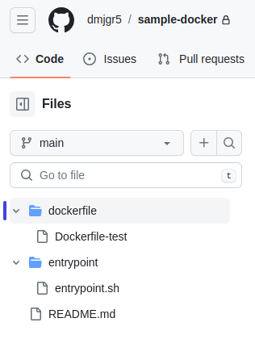

# Github Rest API
{: .no_toc }

## Table of contents
{: .no_toc .text-delta }

1. TOC
{:toc}


---

{: .note }
소프트웨어 개발에 있어서 github 는 소스 저장 및 공유를 위해 반드시 필요한 툴이다. 저장소 생성, 권한 설정 및 기타 다양한 기능을 Rest API 를 통해 확인해 보고자 한다. 먼저 인증을 위해 Setting > Developer Setting > Personal access tokens 에서 발급한 토큰을 Bearer Token 통해 인증이 가능하다.


------


## 사용자 정보 조회

```sh
GET https://api.github.com/user
```

## 저장소 생성

```sh
POST https://api.github.com/user/repos
{
  "name" : "CreateRepoTest"
}
```

```sh
{
    "id": 727710605,
    "node_id": "R_kgDOK1_7jQ",
    "name": "CreateRepoTest",
    "full_name": "user1/CreateRepoTest",
    "private": false,
    "owner": {
        "login": "user1",
     ...생략

    },
    "html_url": "https://github.com/user1/CreateRepoTest",
    ...생략
}
```

결과 중에 `html_url` 값을 보면 생성된 저장소의 URL 을 확인할 수 있고 접속 시 아래와 같이 생성됨을 확인할 수 있다.


## Content 올리기

```sh
PUT https://api.github.com/repos/user1/CreateRepoTest/contents/dir1/dir2/uploadfile.txt
Content-Type: application/vnd.github+json
{
  "message" : "upload test",
  "content" : "dGhpcyBpcyB1cGxvYWQgdGVzdCDsnoXri4jri6Qu"
}
```
```sh
{
    "content": {
        "name": "uploadfile.txt",
        "path": "dir1/dir2/uploadfile.txt",
        "sha": "689fa2f308d660445d8f3311065879b1d8aeb07d",
        "size": 30,
        "url": "https://api.github.com/repos/user1/CreateRepoTest/contents/dir1/dir2/uploadfile.txt?ref=main",
        "html_url": "https://github.com/user1/CreateRepoTest/blob/main/dir1/dir2/uploadfile.txt",
        "git_url": "https://api.github.com/repos/user1/CreateRepoTest/git/blobs/689fa2f308d660445d8f3311065879b1d8aeb07d",
        "download_url": "https://raw.githubusercontent.com/user1/CreateRepoTest/main/dir1/dir2/uploadfile.txt",
        "type": "file",
        "_links": {
            "self": "https://api.github.com/repos/user1/CreateRepoTest/contents/dir1/dir2/uploadfile.txt?ref=main",
            "git": "https://api.github.com/repos/user1/CreateRepoTest/git/blobs/689fa2f308d660445d8f3311065879b1d8aeb07d",
            "html": "https://github.com/user1/CreateRepoTest/blob/main/dir1/dir2/uploadfile.txt"
        }
    },
    "commit": {
        "sha": "851f7923d7919b5f45fe3a7c528394ddc1da767c",
        "node_id": "C_kwDOK1_7jdoAKDg1MWY3OTIzZDc5MTliNWY0NWZlM2E3YzUyODM5NGRkYzFkYTc2N2M",
        "url": "https://api.github.com/repos/user1/CreateRepoTest/git/commits/851f7923d7919b5f45fe3a7c528394ddc1da767c",
        "html_url": "https://github.com/user1/CreateRepoTest/commit/851f7923d7919b5f45fe3a7c528394ddc1da767c",
        "author": {
            "name": "user1",
            "email": "88672316+user1@users.noreply.github.com",
            "date": "2023-12-05T12:54:06Z"
        },
        "committer": {
            "name": "user1",
            "email": "88672316+user1@users.noreply.github.com",
            "date": "2023-12-05T12:54:06Z"
        },
        "tree": {
            "sha": "6f2283eeec0f2d9cd19fc6800f0592c569f9f8a2",
            "url": "https://api.github.com/repos/user1/CreateRepoTest/git/trees/6f2283eeec0f2d9cd19fc6800f0592c569f9f8a2"
        },
        "message": "upload test",
        "parents": [],
        "verification": {
            "verified": false,
            "reason": "unsigned",
            "signature": null,
            "payload": null
        }
    }
}
```

위와 같이 생성 후 github 에 해당 URL 로 파일이 생성되었음을 확인할 수 있다.


## Content 내려받기

```sh
GET https://api.github.com/repos/user1/CreateRepoTest/contents/dir1/dir2/uploadfile.txt
```

```sh
{
    "name": "uploadfile.txt",
    "path": "dir1/dir2/uploadfile.txt",
    "sha": "689fa2f308d660445d8f3311065879b1d8aeb07d",
    "size": 30,
    "url": "https://api.github.com/repos/user1/CreateRepoTest/contents/dir1/dir2/uploadfile.txt?ref=main",
    "html_url": "https://github.com/user1/CreateRepoTest/blob/main/dir1/dir2/uploadfile.txt",
    "git_url": "https://api.github.com/repos/user1/CreateRepoTest/git/blobs/689fa2f308d660445d8f3311065879b1d8aeb07d",
    "download_url": "https://raw.githubusercontent.com/user1/CreateRepoTest/main/dir1/dir2/uploadfile.txt",
    "type": "file",
    "content": "dGhpcyBpcyB1cGxvYWQgdGVzdCDsnoXri4jri6Qu\n",
    "encoding": "base64",
    "_links": {
        "self": "https://api.github.com/repos/user1/CreateRepoTest/contents/dir1/dir2/uploadfile.txt?ref=main",
        "git": "https://api.github.com/repos/user1/CreateRepoTest/git/blobs/689fa2f308d660445d8f3311065879b1d8aeb07d",
        "html": "https://github.com/user1/CreateRepoTest/blob/main/dir1/dir2/uploadfile.txt"
    }
}
``` 

위와 같이 content 항목에 base64 데이터를 decoding 하면 아래 내용과 같다.

> dGhpcyBpcyB1cGxvYWQgdGVzdCDsnoXri4jri6Qu
>
> this is upload test 입니다.


## Content 업데이트하기

```sh
PUT https://api.github.com/repos/user1/CreateRepoTest/contents/dir1/dir2/uploadfile.txt
{
  "message" : "upload test- 2nd update",
  "content" : "dGhpcyBpcyB1cGxvYWQgdGVzdCDsnoXri4jri6QuIHVwZGF0ZSDtlZwg64K07Jqp7J6F64uI64ukLg==",
  "sha" : "689fa2f308d660445d8f3311065879b1d8aeb07d"
}
```

파일 생성시와 동일하나 업데이트의 경우에는 해당 파일의 sha 정보를 추가해주어야 한다.

```sh
{
    "content": {
        "name": "uploadfile.txt",
        "path": "dir1/dir2/uploadfile.txt",
        "sha": "aa00ac0b23a45ab14085b8bc4a6fb0058760761d",
        "size": 58,
        "url": "https://api.github.com/repos/user1/CreateRepoTest/contents/dir1/dir2/uploadfile.txt?ref=main",
        "html_url": "https://github.com/user1/CreateRepoTest/blob/main/dir1/dir2/uploadfile.txt",
        "git_url": "https://api.github.com/repos/user1/CreateRepoTest/git/blobs/aa00ac0b23a45ab14085b8bc4a6fb0058760761d",
        "download_url": "https://raw.githubusercontent.com/user1/CreateRepoTest/main/dir1/dir2/uploadfile.txt",
        "type": "file",
        "_links": {
            "self": "https://api.github.com/repos/user1/CreateRepoTest/contents/dir1/dir2/uploadfile.txt?ref=main",
            "git": "https://api.github.com/repos/user1/CreateRepoTest/git/blobs/aa00ac0b23a45ab14085b8bc4a6fb0058760761d",
            "html": "https://github.com/user1/CreateRepoTest/blob/main/dir1/dir2/uploadfile.txt"
        }
    },
    "commit": {
        "sha": "8cb9eb75a9cadf3ba174efeb9d11bc18b4a4fb84",
        "node_id": "C_kwDOK1_7jdoAKDhjYjllYjc1YTljYWRmM2JhMTc0ZWZlYjlkMTFiYzE4YjRhNGZiODQ",
        "url": "https://api.github.com/repos/user1/CreateRepoTest/git/commits/8cb9eb75a9cadf3ba174efeb9d11bc18b4a4fb84",
        "html_url": "https://github.com/user1/CreateRepoTest/commit/8cb9eb75a9cadf3ba174efeb9d11bc18b4a4fb84",
        "author": {
            "name": "user1",
            "email": "88672316+user1@users.noreply.github.com",
            "date": "2023-12-05T13:09:08Z"
        },
        "committer": {
            "name": "user1",
            "email": "88672316+user1@users.noreply.github.com",
            "date": "2023-12-05T13:09:08Z"
        },
        "tree": {
            "sha": "cb6ada3012c10e6f39d189ba1f571e9c0488deb5",
            "url": "https://api.github.com/repos/user1/CreateRepoTest/git/trees/cb6ada3012c10e6f39d189ba1f571e9c0488deb5"
        },
        "message": "upload test- 2nd update",
        "parents": [
            {
                "sha": "f4858dd22e833cb472128b819787cb8d3f93cc22",
                "url": "https://api.github.com/repos/user1/CreateRepoTest/git/commits/f4858dd22e833cb472128b819787cb8d3f93cc22",
                "html_url": "https://github.com/user1/CreateRepoTest/commit/f4858dd22e833cb472128b819787cb8d3f93cc22"
            }
        ],
        "verification": {
            "verified": false,
            "reason": "unsigned",
            "signature": null,
            "payload": null
        }
    }
}
```

github 에서 파일 내용을 보면 아래와 같이 수정된 것을 확인할 수 있다.


## Content 삭제하기

```sh 
DELETE https://api.github.com/repos/user1/CreateRepoTest/contents/dir1/dir2/uploadfile2.txt
```

아래와 같이 삭제됐음을 확인할 수 있다.


## 저장소 리스트 조회하기



위와 같은 저장소 내 폴더/파일 리스트가 있다고 가정한다.

{: .note}
> `curl -H "Accept: application/vnd.github.v3+json" \
     "https://api.github.com/repos/${owner}/${repo}/contents/${folder}"` 
>
> 위 URL 참조하여 조회할 수 있다.

### 저장소 내 최상위 리스트 조회하기

type 에서 dir 또는 file 로 구분됨을 알 수 있다.


```json
GET https://api.github.com/repos/dmjgr5/sample-docker/contents

---

[
    {
        "name": "README.md",
        "path": "README.md",
        "sha": "ff535546c69e8d3bd737026789a182d300b19b45",
        "size": 15,
        "url": "https://api.github.com/repos/dmjgr5/sample-docker/contents/README.md?ref=main",
        "html_url": "https://github.com/dmjgr5/sample-docker/blob/main/README.md",
        "git_url": "https://api.github.com/repos/dmjgr5/sample-docker/git/blobs/ff535546c69e8d3bd737026789a182d300b19b45",
        "download_url": "https://raw.githubusercontent.com/dmjgr5/sample-docker/main/README.md?token=AVEQQPBFOQCWJDKVEUEPCXDFPZQNI",
        "type": "file",
        "_links": {
            "self": "https://api.github.com/repos/dmjgr5/sample-docker/contents/README.md?ref=main",
            "git": "https://api.github.com/repos/dmjgr5/sample-docker/git/blobs/ff535546c69e8d3bd737026789a182d300b19b45",
            "html": "https://github.com/dmjgr5/sample-docker/blob/main/README.md"
        }
    },
    {
        "name": "dockerfile",
        "path": "dockerfile",
        "sha": "34bdf9ccf33b4eea07b4a720a1d57b9a99d5ef8e",
        "size": 0,
        "url": "https://api.github.com/repos/dmjgr5/sample-docker/contents/dockerfile?ref=main",
        "html_url": "https://github.com/dmjgr5/sample-docker/tree/main/dockerfile",
        "git_url": "https://api.github.com/repos/dmjgr5/sample-docker/git/trees/34bdf9ccf33b4eea07b4a720a1d57b9a99d5ef8e",
        "download_url": null,
        "type": "dir",
        "_links": {
            "self": "https://api.github.com/repos/dmjgr5/sample-docker/contents/dockerfile?ref=main",
            "git": "https://api.github.com/repos/dmjgr5/sample-docker/git/trees/34bdf9ccf33b4eea07b4a720a1d57b9a99d5ef8e",
            "html": "https://github.com/dmjgr5/sample-docker/tree/main/dockerfile"
        }
    },
    {
        "name": "entrypoint",
        "path": "entrypoint",
        "sha": "dc3cbe51901d1798a08d0a43f748e0a3bf57ff34",
        "size": 0,
        "url": "https://api.github.com/repos/dmjgr5/sample-docker/contents/entrypoint?ref=main",
        "html_url": "https://github.com/dmjgr5/sample-docker/tree/main/entrypoint",
        "git_url": "https://api.github.com/repos/dmjgr5/sample-docker/git/trees/dc3cbe51901d1798a08d0a43f748e0a3bf57ff34",
        "download_url": null,
        "type": "dir",
        "_links": {
            "self": "https://api.github.com/repos/dmjgr5/sample-docker/contents/entrypoint?ref=main",
            "git": "https://api.github.com/repos/dmjgr5/sample-docker/git/trees/dc3cbe51901d1798a08d0a43f748e0a3bf57ff34",
            "html": "https://github.com/dmjgr5/sample-docker/tree/main/entrypoint"
        }
    }
]
```

### subfolder 조회하기

```json
GET https://api.github.com/repos/dmjgr5/sample-docker/contents/dockerfile

---

[
    {
        "name": "Dockerfile-test",
        "path": "dockerfile/Dockerfile-test",
        "sha": "afae04a7ead568213d050e81268b59247580fd36",
        "size": 237,
        "url": "https://api.github.com/repos/dmjgr5/sample-docker/contents/dockerfile/Dockerfile-test?ref=main",
        "html_url": "https://github.com/dmjgr5/sample-docker/blob/main/dockerfile/Dockerfile-test",
        "git_url": "https://api.github.com/repos/dmjgr5/sample-docker/git/blobs/afae04a7ead568213d050e81268b59247580fd36",
        "download_url": "https://raw.githubusercontent.com/dmjgr5/sample-docker/main/dockerfile/Dockerfile-test?token=AVEQQPG6UXEV334NSIJDWUDFPZQPO",
        "type": "file",
        "_links": {
            "self": "https://api.github.com/repos/dmjgr5/sample-docker/contents/dockerfile/Dockerfile-test?ref=main",
            "git": "https://api.github.com/repos/dmjgr5/sample-docker/git/blobs/afae04a7ead568213d050e81268b59247580fd36",
            "html": "https://github.com/dmjgr5/sample-docker/blob/main/dockerfile/Dockerfile-test"
        }
    }
]
```

