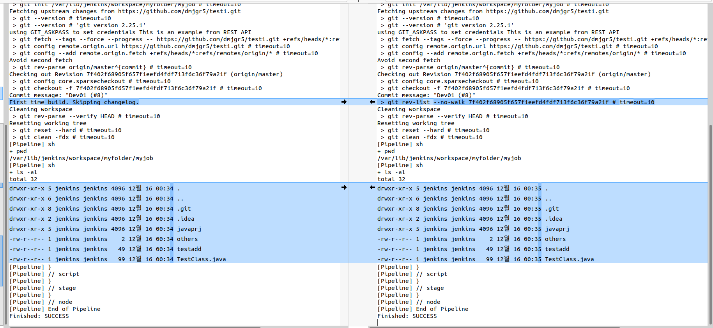
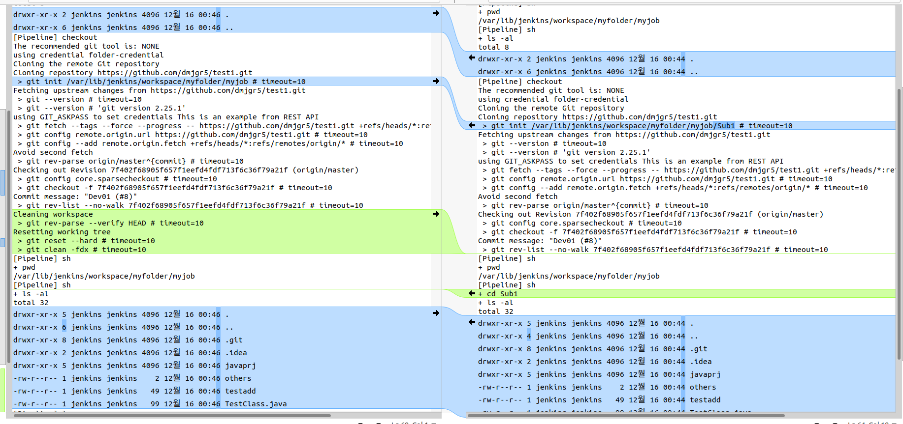

# GitSCM Options
{: .no_toc }

## Table of contents
{: .no_toc .text-delta }

1. TOC
{:toc}


---

{: .note }
> checkout 시 GitSCM 에서의 옵션에 대해 확인해본다.


----

## 테스트 Pipeline 

 
```groovy
pipeline {
    agent any
    stages {
        stage('Checkout') {
            steps {
                script { 

    				sh 'pwd'
                    sh 'ls -al'
                    
                    checkout(
                        [$class: 'GitSCM', 
                        branches: [[name: 'main' ]], 
                        doGenerateSubmoduleConfigurations: false, 
                        //extensions: [[$class: 'RelativeTargetDirectory', relativeTargetDir: 'Sub1']], 
                        extensions: [[$class: 'CleanCheckout']], 
                        submoduleCfg: [], 
                        userRemoteConfigs: [
                            [credentialsId: 'folder-credential', 
                            url: 'https://github.com/dmjgr5/spring-vue-starter.git' ]] 
                        ]
                    )
						
					sh 'pwd'
                    sh 'ls -al'
                    
                }
            }
        }
    }
}

```

## clean before checkout

clone 전에 기존 파일을 삭제는 방법은 여러가지가 있지만 그 중 아래 방법이 간단한 것 같아 정리햔다.
options.skipDefaultCheckout(true) 와 cleanWs() 이며, 간단 예제는 아래와 같다.

```sh
pipeline {
    agent any
    options {
        // This is required if you want to clean before build
        skipDefaultCheckout(true)
    }
    stages {
        stage('Checkout') {
            steps {
                
                // Clean before build
                cleanWs()
        ...
```

아래와 같이 빌드 후의 파일간 시간이 다름을 확인할 수 있다.




## CleanCheckout 과 RelativeTargetDirectory

extensions 항목에 위 두가지 옵션 중 하나를 정할 수 있다. 우선 빌드 로그를 비교해 보자.


아래와 같이 clone 전에 clean 작업을 한다. CleanCheckout 의 경우에는 Clone 바로 직전에 Clean 을 한다. 다만, .git 을 제외한 일부 파일들은 그대로 유지된다. 이 부분은 좀 더 확인이 필요해 보인다.
또한 RelativeTargetDirectory 는 ws 내에서 추가 폴더로 checkout 위치를 지정할 수 있다.



